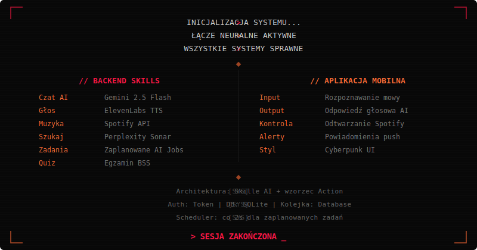

<div align="center">




<br>

<a href="https://laravel.com"></a>&nbsp;
<a href="https://expo.dev"></a>&nbsp;
<a href="https://php.net"></a>&nbsp;
<a href="https://reactnative.dev"></a>

<br><br>

<details>
<summary><b>SEKWENCJA URUCHOMIENIA</b></summary>
<br>

```bash
# Backend
composer setup
composer dev              # localhost:8000

# Mobile
cd mobile && bun install
bun start
```

</details>

</div>
