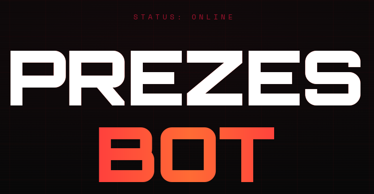

<table bgcolor="#080808" cellspacing="0" border="0" width="100%"><tr><td align="center">

 

<samp>
> INICJALIZACJA SYSTEMU... 
> ŁĄCZE NEURALNE AKTYWNE 
> WSZYSTKIE SYSTEMY SPRAWNE
</samp>

  

&nbsp;
&nbsp;
&nbsp;

  

</td></tr></table>

<table bgcolor="#080808" cellspacing="0" border="0" width="100%">
<tr>
<td valign="top" width="50%">
 

<samp>// BACKEND SKILLS</samp>

 
<pre>
$skills = [
    'Czat AI'  => 'Gemini 2.5 Flash',
    'Głos'     => 'ElevenLabs TTS',
    'Muzyka'   => 'Spotify API',
    'Szukaj'   => 'Perplexity Sonar',
    'Zadania'  => 'Scheduled AI Jobs',
    'Quiz'     => 'Egzamin BSS',
];
</pre>
</td>
<td valign="top" width="50%">
 

<samp>// APLIKACJA MOBILNA</samp>

 
<pre>
const app = {
  input:    "Rozpoznawanie mowy",
  output:   "Odpowiedź głosowa AI",
  kontrola: "Odtwarzanie Spotify",
  alerty:   "Powiadomienia push",
  styl:     "Cyberpunk UI",
};
</pre>
</td>
</tr>
</table>

<table bgcolor="#080808" cellspacing="0" border="0" width="100%"><tr><td align="center">
 

<samp>> SEKWENCJA URUCHOMIENIA</samp>

 
<pre>
# Backend
composer setup
composer dev              # localhost:8000

# Mobile
cd mobile && bun install
bun start
</pre>

 

<samp>
[SYS] Architektura: Skille AI + wzorzec Action 
[SYS] Auth: Token | DB: SQLite | Kolejka: Database 
[SYS] Scheduler: co 2s dla zaplanowanych zadań
</samp>

  

<samp>> SESJA ZAKOŃCZONA _</samp>

  

</td></tr></table>

